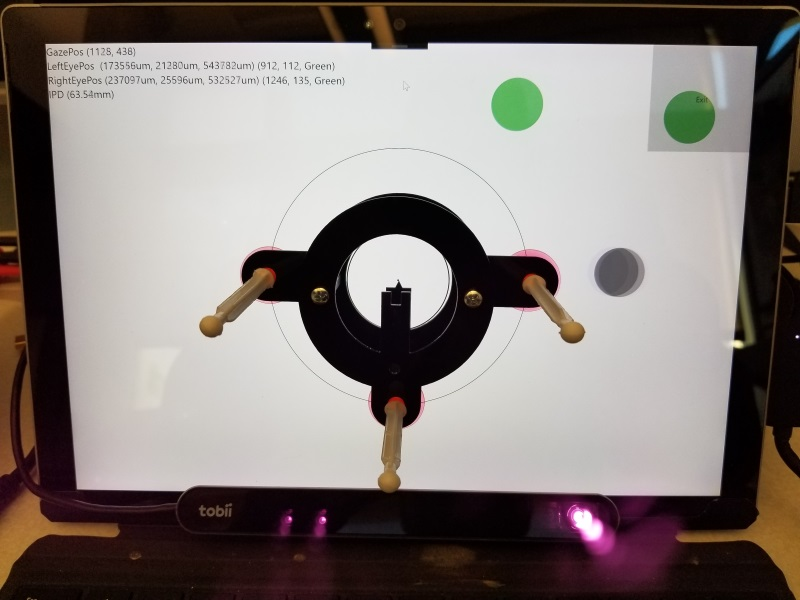
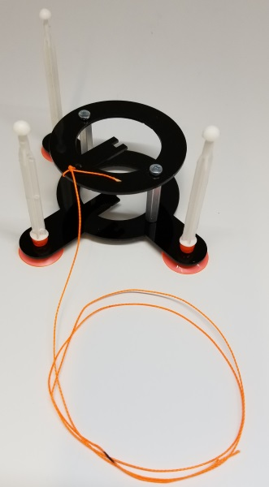

# Positioning Tool

## Purpose

The purpose of the positioning tool is to give you a better understanding of how your eye tracker responds to head movement. This includes general eye position data, as well as how the precision of eye tracking is affected by head movement.

## Implementation

The positioning tool is based on the [GazeInputSourcePreview](https://docs.microsoft.com/en-us/uwp/api/windows.devices.input.preview.gazeinputsourcepreview), specifically utilizing the [GazeMovedEvent](https://docs.microsoft.com/en-us/uwp/api/windows.devices.input.preview.gazeinputsourcepreview.gazemoved). Whenever the callback for GazeMoved is called, we receive the `CurrentPoint` (a [GazePointPreview](https://docs.microsoft.com/en-us/uwp/api/windows.devices.input.preview.gazepointpreview)) object which contains, among other properties, the current [EyeGazePosition](https://docs.microsoft.com/en-us/uwp/api/windows.devices.input.preview.gazepointpreview.eyegazeposition) as well as the [HidInputReport](https://docs.microsoft.com/en-us/uwp/api/windows.devices.input.preview.gazepointpreview.hidinputreport).

The positioning data is extracted from the `HidInputReport` and then mapped to the screen coordinates. Colored ellipses are used to indicate gaze and eye positions. Red indicates the user is too close or too far from the eye tracker, yellow being closer to ideal, and green indicates the optimal positioning. The actual data is also displayed in the upper left corner for diagnostic purposes.

## Reticle

We have provided [designs for a reticle](Reticle\README.md) - a tool used for determining the accuracy of eye/head position data being reported by the tracker. The reticle is mounted using the circle templates displayed in the application. By aligning your dominant eye with the reticle you will have positioned your head to be perpendicular to the display and your eye will be centered in the X/Y plane of the display. From there you can inspect the accuracy of the reported eye position in relationship to your actual position.

There is also a hole provided such that a string can be attached. You can use a lenght of string marked for 65cm from the screen to help determine accuracy of the Z axis data that is being reported by the eye tracker.

### Reticle in use

### Reticle with String Attached

## Limitations

The positioning data is provided via the `GazeMoved` event. If there is no eye tracking data being provided, then there will not be any position data surfaced.
